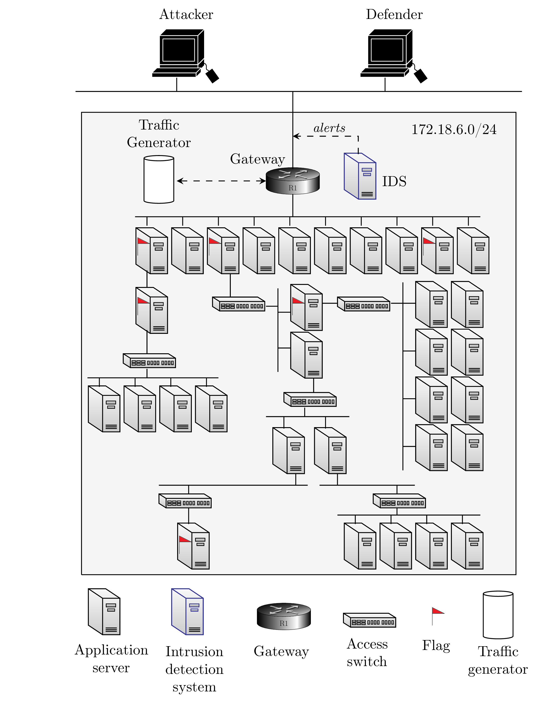

# Optimal Intrusion Response

An OpenAI Gym interface to a MDP/Markov Game model for optimal intrusion response of a realistic infrastructure simulated using system traces.

<p align="center">
    <a href="https://img.shields.io/badge/license-CC%20BY--SA%204.0-green">
        </a>
    <a href="https://img.shields.io/badge/version-1.0.0-blue">
        </a>
</p>

## Included Environments

- `optimal-intrusion-response-v1`
- `optimal-intrusion-response-v2`
- `optimal-intrusion-response-v3`

## Requirements
- Python 3.5+
- OpenAI Gym
- NumPy
- jsonpickle (for configuration files)
- torch (for baseline algorithms)


## Installation

```bash
# install from pip
pip install gym-optimal-intrusion-response==1.0.0
# local install from source
$ pip install -e gym-optimal-intrusion-response
# force upgrade deps
$ pip install -e gym-optimal-intrusion-response --upgrade

# git clone and install from source
git clone https://github.com/Limmen/gym-optimal-intrusion-response
cd gym-idsgame
pip3 install -e .
```

## Usage
The environment can be accessed like any other OpenAI environment with `gym.make`.
Once the environment has been created, the API functions
`step()`, `reset()`, `render()`, and `close()` can be used to train any RL algorithm of
your preference.
```python
import gym
from gym_idsgame.envs import IdsGameEnv
env_name = "optimal-intrusion-response-v1"
env = gym.make(env_name)
```

## Infrastructure

<p align="center">

</p>

## Traces

Alert/login traces from the emulated infrastructure are available in ([./traces](./traces)).

## Publications

Preprint is available ([here](https://arxiv.org/abs/2106.07160))

``` bash
@misc{hammar2021learning,
      title={Learning Intrusion Prevention Policies through Optimal Stopping},
      author={Kim Hammar and Rolf Stadler},
      year={2021},
      eprint={2106.07160},
      archivePrefix={arXiv},
      primaryClass={cs.AI}
```

## Author & Maintainer

Kim Hammar <kimham@kth.se>

## Copyright and license

[LICENSE](LICENSE.md)

Creative Commons

(C) 2021, Kim Hammar
